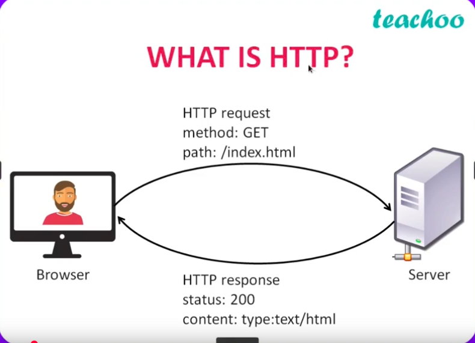

## Mensageria

### O que é?

Mensageria é um modelo de comunicação entre aplicações, onde uma aplicação (chamada de producer) envia dados como mensagens para uma fila, e outra aplicação (chamada de consumer) consome essas mensagens posteriormente.

Diferente de uma comunicação REST tradicional, onde a aplicação A envia uma requisição e precisa esperar a resposta da aplicação B, na mensageria a comunicação é assíncrona: a aplicação A (produtora) envia a mensagem para a fila e continua seu processo, mesmo que a aplicação B (consumidora) ainda não esteja pronta para responder

 

### Quando usar mensageria?

- Comunicação assíncrona:

    Quando a aplicação não precisa de uma resposta imediata. A mensagem é enviada para a fila e processada depois.

 

- Resiliência:

    Mesmo que ocorra uma falha ou exceção durante o processamento da mensagem, o sistema pode ser configurado para tentar novamente automaticamente, sem que o produtor precise reenviar.

 

- Escalabilidade:

    É possível aumentar ou reduzir o número de consumidores conforme a demanda. Em horários de pico, mais instâncias podem consumir da mesma fila para manter o desempenho.

 

### Comunicação síncrona e assíncrona

#### Comunicação síncrona (exemplo REST)

 
 

- Um agente/aplicacao faz uma requisição HTTP para um servidor, utilizando um determinado method (GET/POST/PUT/DELETE) e um endereço(url) e esse servidor retorna uma resposta para esse agente.

 

- Na comunicação REST (síncrona), é uma via de mão dupla:
A aplicação que faz a requisição precisa da resposta na hora para continuar. Ou seja, depende do outro lado estar disponível e responder.

 

#### Comunicação assíncrona (exemplo mensageria)

 
 

- Na comunicação com mensageria (AMQP, assíncrona), é uma via de mão única:
O produtor envia a mensagem para a fila e **não precisa esperar pela resposta imediata**. A mensagem será processada depois, independente de o outro lado estar online no momento.
 

### Message broker

Um message broker é um programa que gerencia a troca de mensagens entre sistemas. Ele recebe as mensagens de quem envia, guarda numa fila e entrega para quem vai consumir, garantindo que nada se perca. 

Resumindo, é a ferramente que vamos usar para trabalhar com mensageria.

Exemplos populares: **RabbitMQ**, Apache Kafka, ActiveMQ.