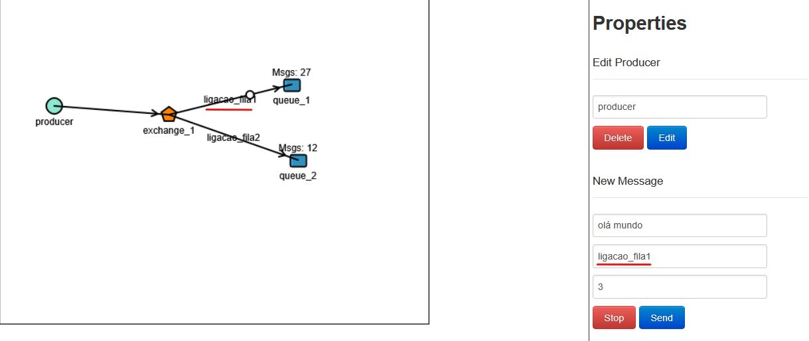
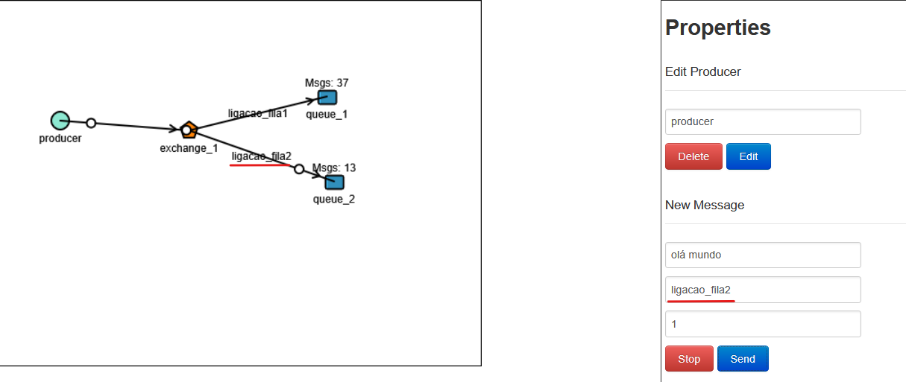
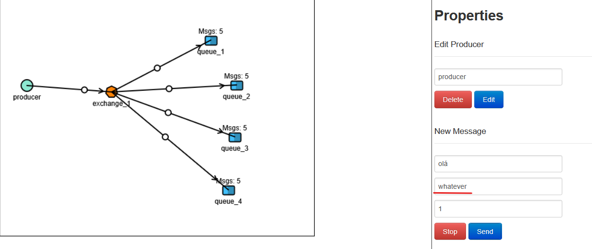

## AMQP (Advanced Message Queuing Protocol)

AMQP é um protocolo que define as regras para envio, roteamento e recebimento de mensagens em sistemas de mensageria, como o RabbitMQ.

 

### Conceitos de RabbitMQ

Conceitos importantes precisam estar claros:

- **Producer**: Aplicativo que envia as mensagens.

 

- **Consumer**: Aplicação que recebe as mensagens.

 

- **Exchanges**: Decide para qual fila a mensagem deve ser enviada.

 

- **Routing Key** (Chave de Roteamento): Pense nisso como o "endereço" que o Producer coloca na mensagem. Quando o Produtor envia a mensagem para a Exchange, ele inclui essa Routing Key para indicar o destino desejado.

 

- **Queues**(filas): Onde as mensagens ficam armazenadas até serem consumidas.

 

- **Binding** (Vínculo): É a conexão ou "regra" que liga uma Exchange a uma Fila.

 

- **Binding Key (Chave de Vínculo)**: A Exchange usa essa Binding Key para comparar com a Routing Key da mensagem e, assim, decidir se a mensagem deve ser enviada para aquela fila.

 

- **Mensagem**: Informação enviada do produtor para o consumidor através do RabbitMQ.

 

### Exchange (O Distribuidor de Mensagens)

Pense na Exchange como o distribuidor central de mensagens do RabbitMQ. Quando sua aplicação (o produtor) envia uma mensagem, ela nunca vai direto para uma fila. Primeiro, ela chega na Exchange.

A principal função da Exchange é decidir para qual fila (ou filas) essa mensagem deve ser entregue. Ela faz essa "decisão" com base em regras de roteamento que configuramos, que são os bindings e as routing keys.

 

#### Tipos de Exchange

O jeito que a Exchange decide para onde mandar a mensagem depende do seu **tipo**. 

- **Direct**: Roteia mensagens para filas cuja Binding Key corresponde exatamente à Routing Key da mensagem.

    

     

    

     
     
    
    📖 A Exchange recebe a mensagem, analisa o Routing Key (o "endereço" dela) e verifica se ela possui algum Binding Key com esse mesmo "endereço". Se sim, ela envia a mensagem para aquela fila.

     

    Imagine que:

    Você (o producer) envia uma carta e escreve um "endereço" nela. Esse "endereço" é a Routing Key.
    A Exchange (o carteiro) tem várias caixas de correio (as filas). Cada caixa tem um "endereço que ela aceita", que é a Binding Key.

    O que acontece? O carteiro (Exchange) pega sua carta. Se o "endereço da carta" (Routing Key) for igualzinho a um dos "endereços que ele aceita" (Binding Key), ele entrega a carta naquela caixa de correio (fila).

 
 

- **Fanout**: Tem um comportamento de "manda para todos". Ele simplesmente pega a mensagem e a replica para todas as filas, ignorando a routing key.

    

<ht>
 

### ACK

ACK é um sinal que o consumidor envia de volta para o RabbitMQ, dizendo: "Ok, recebi e processei essa mensagem! Pode apagar da fila."

Se o consumidor não envia o ACK (porque falhou ou não terminou), a mensagem fica lá para ser entregue de novo.

⚠️ melhorar resumo depois...