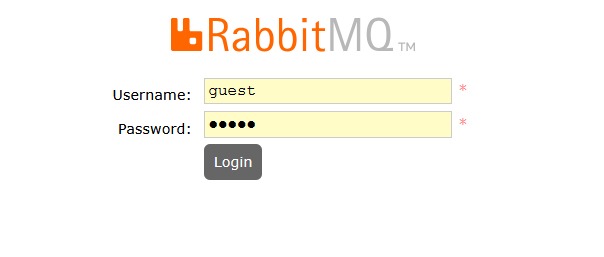

## Subindo o RabbitMQ com Docker

A forma mais rápida e recomendada para ter o RabbitMQ rodando localmente para seus estudos e desenvolvimento é usando o Docker. Com apenas um comando, você configura tudo que precisa!

<br>

Para iniciar um container do RabbitMQ, fazemos:

```bash
 docker run --name rabbit_container  -d  -p 15672:15672 -p 5672:5672 -e RABBITMQ_DEFAULT_USER=biel -e RABBITMQ_DEFAULT_PASS=123  imagem_do_rabbit;
```

<br>

- `--name` --> setamos o nome do container

<br>

- `--d` --> Inicia o container em segundo plano (detached mode), liberando seu terminal para outras tarefas.

<br>

- `-p 5672:5672` --> Mapeia a porta principal de comunicação do RabbitMQ. É por aqui que suas aplicações Java/Spring Boot se conectam para enviar e receber mensagens.

<br>

- `-p 15672:15672` --> Mapeia a porta da interface de gerenciamento web do RabbitMQ. Você usa essa porta no navegador (http://localhost:15672) para visualizar filas, exchanges e monitorar o RabbitMQ.

<br>

`-e RABBITMQ_DEFAULT_USER=`: Define o usuário padrão para biel.

<br>

`-e RABBITMQ_DEFAULT_PASS=`: Define a senha padrão para 123.

<br>
<br>

⚠️Importante lembrar que a versao da imagem do rabbitmq precisa estar assim: `rabbitmq:management`.

A imagem `rabbitmq:management` é a mesma do RabbitMQ, mas com uma interface web que te permite gerenciar as filas, exchanges e tudo mais. Ela adiciona essa interface na porta 15672.

Em resumo:

- **rabbitmq**: Apenas o servidor de mensageria.

- **rabbitmq:management**: O servidor de mensageria com a interface de gerenciamento na porta 15672.


<br>
<br>

Agora, que já subimos nosso container, basta acessar: `http://localhost:15672/`:




💡 Se você não tiver setado as env variables `-e` no docker run, o usuário e senha padrão são:

- user: **guest**
- password: **guest**


<br>

✏️ Pratique um pouco, criando uma exchange para **direct**:

1. Crie uma exchange
1. Crie uma fila
1. Faça um binding entre essa exchange e a fila
1. Crie uma mensagem, passando a routing key

<br>

✏️ Pratique um pouco, criando uma exchange para **fanout**:

1. Crie uma exchange
1. Crie uma fila
1. Faça um binding entre essa exchange e a fila
1. Crie uma mensagem, passando a routing key, não passando, nao importa... Todas as filas vão receber

